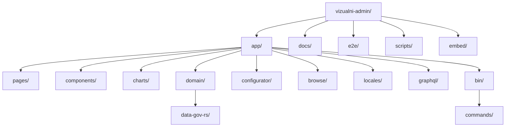
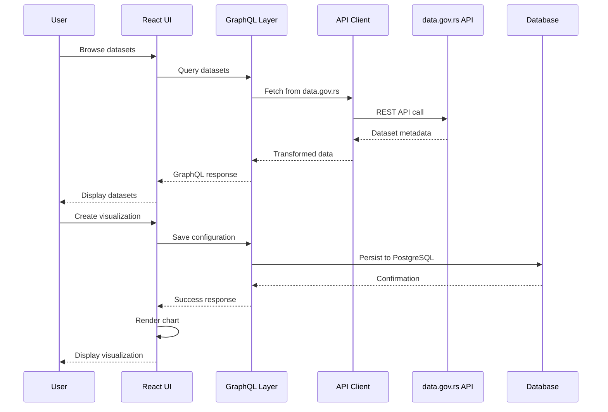
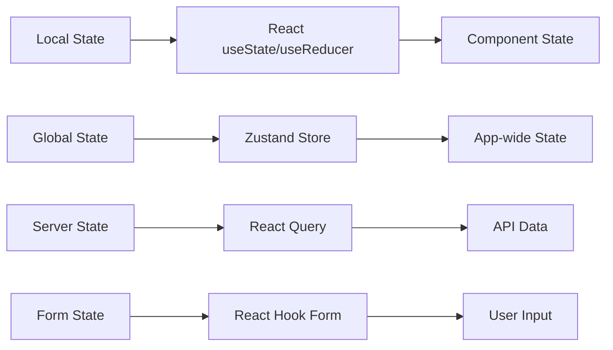
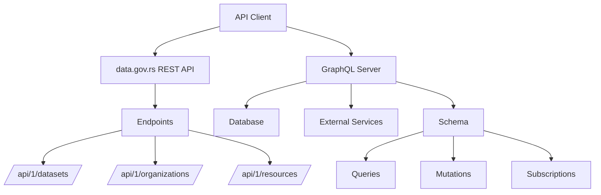
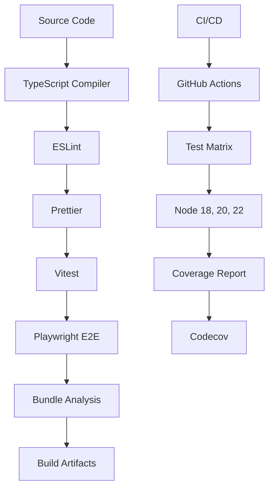

graph TB
    A[data.gov.rs API] --> B[API Client]
    B --> C[GraphQL Layer]
    C --> D[React UI Components]
    D --> E[Chart Rendering Engine]
    F[User] --> D
    D --> G[Export Services]
    H[Database] --> C
    I[File Storage] --> G
```

The architecture follows a layered approach with clear separation of concerns:
- **Data Layer**: Handles external API integration and data transformation
- **Application Layer**: Manages business logic and state
- **Presentation Layer**: Provides user interface and visualization rendering
- **Infrastructure Layer**: Manages persistence, caching, and deployment

## Component Structure



### Key Components

- **pages/**: Next.js page components and routing
- **components/**: Reusable React UI components
- **charts/**: Chart implementations using D3.js and Vega
- **domain/**: Business logic and domain models
- **configurator/**: Chart configuration interface
- **browse/**: Dataset browsing and search functionality
- **locales/**: Internationalization and localization
- **graphql/**: GraphQL schema and resolvers
- **bin/**: CLI tools and commands

## Data Flow



### Data Processing Pipeline

1. **Ingestion**: Data is fetched from data.gov.rs REST API
2. **Transformation**: Raw data is normalized and transformed via GraphQL resolvers
3. **Caching**: Frequently accessed data is cached in Redis/memory
4. **Presentation**: Data is formatted for chart rendering engines
5. **Export**: Visualizations can be exported in multiple formats

## State Management

The application uses a combination of local and global state management:



### State Management Strategy

- **Local State**: Component-specific state using React hooks
- **Global State**: Application-wide state using Zustand for simplicity and performance
- **Server State**: API data management with React Query for caching and synchronization
- **Form State**: Complex form handling with React Hook Form and validation

**Design Decision**: Chose Zustand over Redux for its lightweight footprint and simpler API, reducing bundle size by ~30KB compared to Redux Toolkit.

## API Integration



### API Client Architecture

The API client (`app/domain/data-gov-rs/client.ts`) provides:
- Type-safe HTTP requests with TypeScript interfaces
- Automatic retry logic with exponential backoff
- Request/response interceptors for logging and error handling
- Caching layer to reduce API calls
- Rate limiting to respect API quotas

**Trade-off**: REST API integration instead of GraphQL for external APIs due to data.gov.rs limitations, with internal GraphQL layer for flexibility.

## Build Pipeline



### Build Process

1. **Linting & Formatting**: ESLint and Prettier ensure code quality
2. **Type Checking**: TypeScript compilation with strict mode
3. **Unit Testing**: Vitest for fast, isolated component testing
4. **Integration Testing**: Playwright for end-to-end user flows
5. **Bundle Analysis**: Size monitoring and optimization
6. **Artifact Generation**: Optimized bundles for different targets

**Design Decision**: Multi-stage Docker builds for efficient layer caching and smaller production images.

## Deployment Architecture

```mermaid
graph TD
    A[Git Push] --> B[GitHub Actions]
    B --> C[Build & Test]
    C --> D{Environment}
    D --> E[Development]
    D --> F[Staging]
    D --> G[Production]
    
    E --> H[Vercel Dev]
    F --> I[Vercel Preview]
    G --> J[Vercel Prod]
    
    G --> K[Docker Build]
    K --> L[Container Registry]
    L --> M[Kubernetes]
    M --> N[Load Balancer]
    N --> O[CDN]